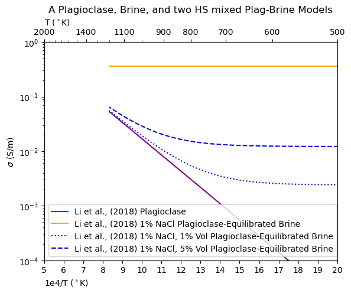

# Pyrrhenius: Electrical Conductivity Modeling for Geologic Materials

<p align="center">
  
</p>


Pyrrhenius is a Python package designed for modeling the electrical conductivity of various geo-materials,  rocks, minerals, and brines, with specific application to the crust and upper mantle. The package provides a curated database of material parameterizations, and a number of useful functionalities, including anisotropy, stochastic sampling, and N-phase mixing laws. 

## Key Features

- **Publication-Tested Database**: A curated collection of over 100 models spanning a wide range of minerals and conditions

- **Extensible Framework**: Pyrrhenius uses a spreadsheet-based database for accessing models and associated metadata, so substituting your own work-groups database is as easy as providing an alternate ``.csv`` file.

- **Interchangeable Parts**: Calculate electric conductivity across any mechanism combinations of mechanisms, model or combinations of models using the ``get_conductivity(*args,**kwargs)`` method.

- **Built with a Numerical Lens**: Stochastically sample model parameters based on reported uncertainties, apply mixing laws to N-dimensional input arrays, and combine any number of relevant models to simulate real rocks and minerals. It was also designed to easily integrate into the broader scientific Python ecosystem including NumPy, SciPy, and Pandas

## Why Pyrrhenius?

Pyrrhenius is particularly useful for researchers studying the conductivity of geo-materials like rocks, minerals, and brines. It simplifies the modeling process by offering pre-configured models for various conditions (e.g., temperature, pressure, water content). Additionally, the package allows users to define their own models and databases for custom experiments.

## Getting Started

### Installation

To install Pyrrhenius, clone the repository and install the necessary dependencies using `pip`:

```bash

   pip install git+git://github.com/k-a-mendoza/pyrrhenius@master
```
### Quickstart
Below is a quick example of how to get started with Pyrrhenius by using the provided database to load a model and calculate conductivity.

```python 
import pyrrhenius.database as phsd

# Initialize the database and load a model
ecdatabase = phsd.Database()

model = ecdatabase.get_model('SEO3_ol') # get the SEO3 olivine model

# Define temperature (K), pressure (GPa), and oxygen fugacity (logfo2)
T = 1000
P = 1.0
logfo2 = 10**-11

# Calculate conductivity
conductivity = model.get_conductivity(T=T, P=P, logfo2=logfo2)
print(f"Conductivity: {conductivity}")
```

## Documentation

Full documentation is available in the docs/ folder, including detailed guides for getting started, using different models, and advanced usage.

## Contributing

We welcome contributions to Pyrrhenius! Feel free to post an issue, submit a pull request, or suggest improvements!

## Did Pyrrhenius Help You?

If pyrrhenius helped you, please consider citing it. We hope to have a JOSS or similar journal publication out soon, so just cite the github for now. 

If it did help you, let us know by posting an issue! Wed'd love to know all about the science it has helped catalyze. 

## License

Pyrrhenius is licensed under the MIT License. See the LICENSE file for details.